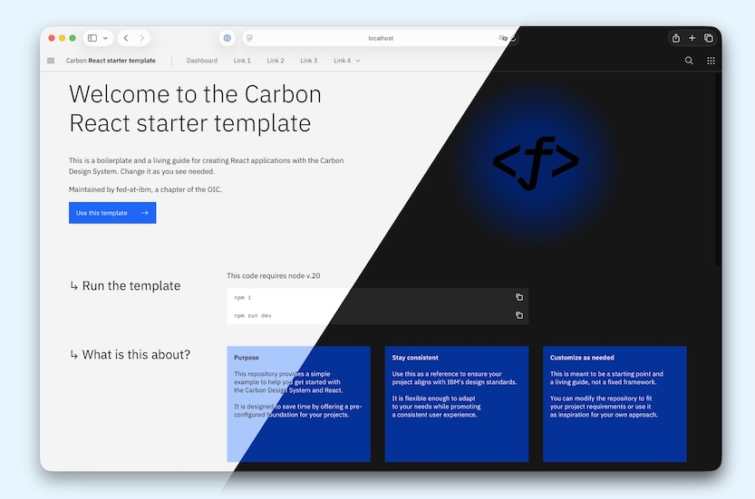

# carbon-react-starter



This project is intended as a guiding template to get you and your team started with a fresh project basing on the Carbon Design System.

It is intended to be helping, not dictating. If you don't know exactly what to use, feel free to take this as a starting point. You can of course swap anything in this stack with your preferred tool if you want to.

## Get started

1. Instantiate this template locally without the git history, specifying the name of the folder for the repository.

   ```bash
   npx degit https://github.com/carbon-design-system/carbon-react-router-starter new-folder
   ```

NOTE: In addition to starting with a clean history `degit` avoids the accidental creation of external repositories.

2. Switch to the new folder

   ```bash
   cd new-folder
   ```

3. Install the dependencies. _Requires Node 24_

   ```bash
   nvm i # Optional, but desirable to make sure you have the supported version
   npm i
   ```

4. Run the template

   ```bash
   npm run dev
   ```

→ Good, you're already set up!

Create a production build with `npm run build`, but be aware that a server runtime is needed as this project uses server-side rendering.

### Running production

1. Build the project

   ```bash
   npm run build
   ```

2. Run the production build
   1. Without compression

   ```bash
   npm run preview
   ```

   2. With compression, best for performance.

   ```bash
   npm run preview:prod
   ```

### Before connecting to github.ibm.com

If you are not familiar with and have never configured your device to work with git, npm, node, ssh etc. then you might want to find a friendly developer to help with your setup. You will at a minimum need:

- Node 24
- Git
- SSH
- NPM
- Your command line connected to git via ssh.

### Connecting to github.ibm.com

1. Create a new repository on github.ibm.com/your-org.
   1. Set the repository name
   2. Choose the visibility
   3. Click "Create repository".
2. Connect your repository.
   1. Before the git instructions.

   ```bash
   git init
   git add .
   git commit -m 'feat: first commit'
   ```

   2. Then the instructions to push and existing repository from the command line, which will look something like the following:

   ```bash
   # Replace `your-ort` and `new-starter` with your own values
   git remote add origin git@github.ibm.com:your-org/new-starter.git
   git branch -M main
   git push -u origin main
   ```

## How does this work

### Philosophy

This project is driven by a few principles:

- Fast to instantiate, easy to understand
- Usable by a large set of projects
- Opinionated but not dictating
- Performance and accessibility oriented

Ultimately, we want to save you time by avoiding you weeks of research to build a simple base stack to create a first iteration from.

### Documentation

While the ultimate documentation is the code, it is, like all languages, possible to write some very complex stories. In creating this project, we have tried to document inline complexity and where we deviate from standard practices or configurations. If you find something confusing, then we consider this a bug and would ask that you raise an issue.

Where documenting inline is not possible or impractical, we have added explanations in the [docs](./docs) folder.

### Project structure

- **Carbon inclusion:** right now, this project embeds the latest version of Carbon core, but not yet Carbon for IBM Products or Carbon for IBM Cloud. Contributions in this direction would be welcome.

- **CSS and SCSS:** Based on Carbon, this project makes extensive use of SCSS. To improve the loading experience and avoid layout shifts and flash of unstyled content, we decided to load the SCSS from the `index.html` file. If you have a case where you load a lot of CSS under very dynamic conditions, you might decide to use an `import` statement inside one of your React components. However, be aware that this should stay as an exception, as the styles will be delayed after the component has been loaded.

- **Server-side rendering:** Server-side rendering is a critical component for most applications to improve their performance. This means here that **the project is separated in two parts - client-side and server-side**.

- **Quality and productivity helpers:** This project contains quite a few helpers to help with consistency, productivity, and speed. For example, it has templates for unit and end-to-end testing. It also contains linters so your team doesn't have to lose time on code formatting.
  With time, we plan to add more helpers to help you monitor your accessibility and front-end performance.

### Testing

This project comes with a pre-configured testing setup using React Testing Library, MSW (Mock Service Worker), and Vitest to make unit and integration tests easy to write and run.

#### Setup

- The test configuration is located in `vite.config.js`, which sets up Vitest with globals, a JSDOM environment, and points to the setup file `src/test/setup.js`.

- This file handles mocking network requests and manages server startup and teardown. It also handles mocking browser features missing in JSDOM.

- The `src/test/server.js` wraps the server with msw's setupServer function and injects networking utils from `src/test/networking.js` that track each outgoing network request and help debugging unit tests.

#### Writing Tests

Add your test files to `src/__test__/*.test.jsx`, import the necessary methods from React Testing Library and MSW and use `render` and `screen` to render your components and interact with them. Use MSW handlers (defined in `src/test/server.js`) to mock API responses for your components.

#### Running Tests

For test execution, run:
`npm run test`

The Vitest runner will also handle test coverage reports automatically.

## Keeping this up to date

We will do our best to update this template on a regular basis. However, if you want to help us, don't hesitate to make your own pull request so we can keep this reliable to use.

## Report problems

Please open an [issue](issues) if you have a bug to report.
