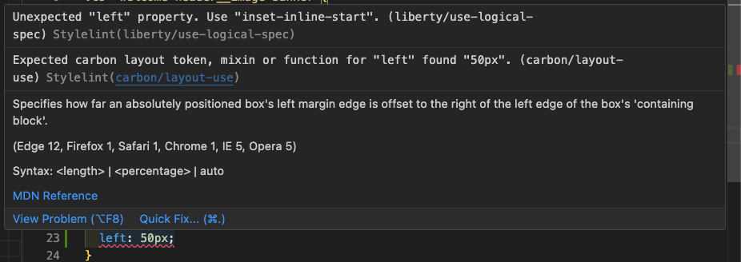
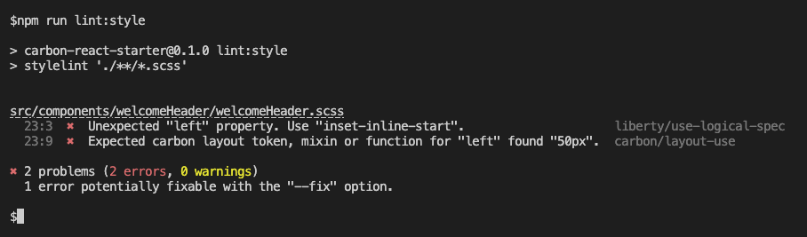
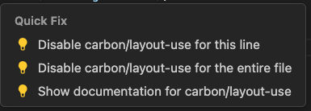
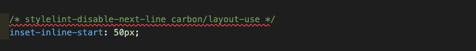
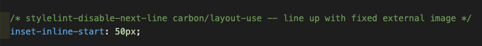

# Stylelint

## Stylelint config

The stylelint configuration builds upon commonly used standards representing millions of downloads from npm.

The **stylelint-config-standard-scs**- with over a million weekly downloads includes the even more popular packages such as

- extends stylelint-config-standard
- extends stylelint-config-recommended-scss
- extends stylelint-scss
- extends stylelint-config-recommended

In addition we include:

- @double-great/stylelint-a11y which contains rules to improve accessibility.
- stylelint-use-logical-spec which enforces use of logical sizing properties e.g. **block-size** instead of **height** and includes an automatic fix.
- stylelint-plugin-carbon-tokens with rules to encourage the use of Carbon SCSS tokens, mixins and functions.

## VSCode plugins

When coding, assuming you have the VSCode [stylelint extension](<(https://marketplace.visualstudio.com/items/?itemName=stylelint.vscode-stylelint)>) installed, VSCode will highlight linting issues as you work.

Where an issue is highlighted you can access information in about the issue in a popup dialog such as the following. Where you can view further information, apply a fix or disable the rule.

.

## Using stylelint

A script to run stylelint from the command line has been included in package.json and can be executed as follows.

```shell
npm run lint:style
```

If you run this command from within the VSCode terminal, you can use **Ctrl/Command + click** to navigate to the issue ein code.



It is also possible to automatically fix some issues by passing **--fix** to stylelint.

```shell
npm run lint:style -- --fix
```

In the case shown **left** will be replaced by the logical property **inset-inline-start**.

Unfortunately not all issues can be automatically resolved. After reviewing the issue you have two choices:

- Obey the rule and update the code.
- Ignore the rule

In general you should try not to ignore rules, but sometimes you have a good reason for doing so. Regardless of your reason **DO NOT** disable the rule for the entire file, one of the options in the quick fix menu.



Instead disable for the current line, which if clicking in the quick fix menu will result in the following.


To encourage you to disable only where you have a good reason to do so a description must be provided. This is done by adding two hyphens after the rule followed by a description.

```scss
/* stylelint-disable-next name-of-rule -- reason-disabled */
```

With a description applied the issue will no longer register in VSCode or when running stylelint from the command line.


